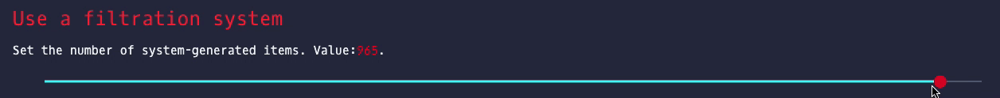

## autoasseting
> 根据设置自动化的产生号码,这些核心包含REGO,FILTER,POSTCALL等模块化核心。
> `poetry run python ./app.py`

### setings
```python
    js = '{"rego":true,"acvalue":true,"dx16":true,"mod2":true,"mod3":true,"mod4":true,"mod5":true,"mod6":true,"mod7":true,"sixlan":true,"zhihe":true,"lianhao":true}'
    p = `postcall`
    p.initPostCall()
    p.instal_json(js=js)
    p.setting_length(500)
    p.tasks_futures()
    # p.tasks_Queue() 
    for k, v in p.todict().items():
        n, t = v
        print(f'[{k:>3}] {n} + {t}')
```

* rego insx.rego 在网页上可以直接编辑。
* filter 设置了好几种常见的过滤器,通过filterN_v3.json来设置，但是可以通过网页来关闭启用。


```json
{
    "name": "dzx",
    "Optional": [0,1,2,3,4,5,6],
    "recommend": [0,1,2,3,4],
    "checked": false,
    "Description": "d is 23-33, z is 12-22,x is 1-11."
}
```
#### json info
* `name` 过滤器名称
* `Optional` 可以使用的选项
* `checked` False ot True
* `Description` info....
* `__commant__` commant...

#### Custom range input
```html
<div class="example">
    <div id="rangeslider" class="noUi-target noUi-ltr noUi-horizontal noUi-txt-dir-ltr">
        <div class="noUi-base">
            <div class="noUi-connects"></div>
            <div class="noUi-origin" style="transform: translate(-80.9868%, 0px); z-index: 4;">
                <div class="noUi-handle noUi-handle-lower" data-handle="0" tabindex="0" role="slider" aria-orientation="horizontal" aria-valuemin="5.0" aria-valuemax="1000.0" aria-valuenow="194.2" aria-valuetext="194.18">
                    <div class="noUi-touch-area"></div>
                </div>
            </div>
        </div>
    </div>
</div>
```
#### Style CSS
* `transform` 
  > transform: translate(0%, 0px); z-index: 4;
```css
/* html root color*/
input[type="range"] {
    /* removing default appearance */
    -webkit-appearance: none;
    appearance: none;
    /* creating a custom design */
    width: 100%;
    cursor: pointer;
    outline: none;
    border: none;
    height: 1px;
    background-color: var(--cool-gray);
}

input[type="range"]::-webkit-slider-runnable-track {
    width: 100%;
    height: 3px;
    cursor: pointer;
    background: transparent;
}

input[type="range"]::-moz-range-track {
    width: 100%;
    height: 3px;
    cursor: pointer;
    background: transparent;
}

/* Thumb: webkit */
input[type="range"]::-webkit-slider-thumb {
    /* removing default appearance */
    -webkit-appearance: none;
    appearance: none;
    /* creating a custom design */
    height: 15px;
    width: 15px;
    background-color: var(--red-pantone);
    border-radius: 50%;
    border: none;
    /* box-shadow: -407px 0 0 400px #f50; emove this line */
    transition: .2s ease-in-out;
}

/* Thumb: Firefox */
input[type="range"]::-moz-range-thumb {
    height: 15px;
    width: 15px;
    background-color: var(--red-pantone);
    border-radius: 50%;
    border: none;
    /* box-shadow: -407px 0 0 400px #f50; emove this line */
    transition: .2s ease-in-out;
}
```
##### Use custom range

###### html
```html
 <div class="example">
    <div id="rangeslider"></div>
</div>
```
* `let ranges = new objJs.meRange('rangeslider', 5, 1000, 5);`
###### CSS
```css

.meRange {
    display: inline-block;
    box-sizing: content-box;
    width: 100%;
    background: transparent;
    transform: rotate(0);
    user-select: none;
}

.meRange .huagui_bg {
    position: absolute;
    width: 100%;
    height: 1px;
    top: 50%;
    -webkit-transform: translate(0, 50%);
    transform: translate(0, -50%);
    background: var(--cool-gray);
}

.meRange .huagui_bg>* {
    /* min max setp hide */
    display: none
}

.meRange .huagui {
    width: 100%;
}

.meRange .huagui .shoubing {
    display: block;
    position: relative;
    height: 16px;
    width: 16px;
    border-radius: 50%;
    -webkit-transform: translate(0px, 0);
    transform: translate(0px, 0);
    background-color: var(--fire-engine-red);
}

.meRange .huagui .shoubing:before {
    content: "";
    position: absolute;
    top: 50%;
    -webkit-transform: translate(0, 50%);
    transform: translate(0, -50%);
    width: var(--oks, 0);
    left: var(--okb, 0);
    /* -left = width = shoubing.width */
    height: 3px;
    background-color: aqua;
}
```
###### javascript
```javascript
export class meRange {
    // <div id="rangeslider" class="meRange">
    //     <div class="huagui_bg">
    //     <Attributes min="5", max="1000", value="25", step="5">
    //     </div>
    //     <div class="huagui">
    //          <div class="shoubing"></div>
    //     </div>
    // </div>
    constructor(idx = 'id', min = 5, max = 1000, step = 5) {
        this.sliderValue = null
        this.range = document.getElementById(idx)
        this.range.classList.add('meRange')
        this.range_width = this.range.getBoundingClientRect().width
        let cls_name = ['huagui_bg', 'huagui']
        if (!Object.is(this.range, null)) {
            cls_name.forEach((v, i, arr) => {
                let temp = this.init_div(v)
                if (v === 'huagui_bg') {
                    this.attr = this.init_Attributes(min, max, step)
                    temp.append(this.attr)
                }
                if (v === 'huagui') {
                    this.shoubing = this.init_div('shoubing')
                    temp.append(this.shoubing)
                }
                this.range.append(temp)
            })
        }
        this.range_max_width = this.range_width - this.shoubing.getBoundingClientRect().width
        this.doStart = e => { return this.startDrag(e) }
        this.doMove = e => { return this.moveDrag(e) }
        this.doEnd = e => { return this.endDrag(e) }
        this.shoubing.addEventListener('mousedown', this.doStart)
    }

    setSRV(idx = 'slider-range-value') {
        // 在web app 上显示当前数值
        let srv = document.getElementById(idx)
        if (!Object.is(srv, null)) {
            this.sliderValue = srv
        } else {
            console.log(`setting SRV done.`)
        }
    }

    echo(val = 25) {
        // 社会元素sliderValue为输出元素
        if (!Object.is(this.sliderValue, null)) {
            this.sliderValue.innerText = val
        }
    }

    setValue(val = 25) {
        // 启动的时候使用
        this.attr.setAttribute('value', val)
        let left = val / (this.max - this.min) * this.range_max_width
        this.shoubing.style.left = `${left}px`;
        this.shoubing.style.setProperty('--oks', `${left}px`)
        this.shoubing.style.setProperty('--okb', `-${left}px`)
        this.echo(val)
        return val
    }


    get min() {
        return Number(this.attr.getAttribute('min'))
    }

    get max() {
        return Number(this.attr.getAttribute('max'))
    }

    get value() {
        return Number(this.attr.getAttribute('value'))
    }

    get step() {
        return Number(this.attr.getAttribute('step'))
    }


    shoubing_left(left = 65) {
        this.shoubing.style.left = `${left}px`;
        this.shoubing.style.setProperty('--oks', `${left}px`)
        this.shoubing.style.setProperty('--okb', `-${left}px`)
        let bili = left / this.range_max_width * (this.max - this.min) + this.min
        bili = this.roundToStep(bili, this.step)
        this.attr.setAttribute('value', bili)
        this.echo(bili)
    }

    roundToStep(number = 5, step = 5) {
        // 将数字格式化成 step的倍数
        if (number % step === 0) {
            return number;
        } else {
            return Math.ceil(number / step) * step;
        }
    }

    init_Attributes(min = 5, max = 1000, step = 5) {
        let attr = document.createElement('attributes')
        attr.setAttribute('min', min)
        attr.setAttribute('max', max)
        attr.setAttribute('value', min)
        attr.setAttribute('step', step)
        return attr
    }

    init_div(cls = 'huagui_bg') {
        let div = document.createElement('div')
        div.classList.add(cls)
        return div
    }

    startDrag(event) {
        this.startX = event.clientX
        // console.log(`startDrag ${event.clientX}`)
        document.addEventListener('mousemove', this.doMove);
        document.addEventListener('mouseup', this.doEnd);
    }

    moveDrag(event) {
        // let getStyle = window.getComputedStyle(this.shoubing);
        // let leftVal = parseInt(getStyle.left) + (event.clientX - this.startX);
        let leftVal = this.shoubing.offsetLeft + (event.clientX - this.startX);
        // console.log(`moveDrag ${leftVal}`)
        if (leftVal >= 0 && leftVal <= this.range_max_width) {
            this.shoubing_left(leftVal)
        };
        this.startX = event.clientX
    }

    endDrag(event) {
        // console.log(`endDrag ${event}`)
        document.removeEventListener('mousemove', this.doMove);
        document.removeEventListener('mouseup', this.doEnd);
    }
}
```
